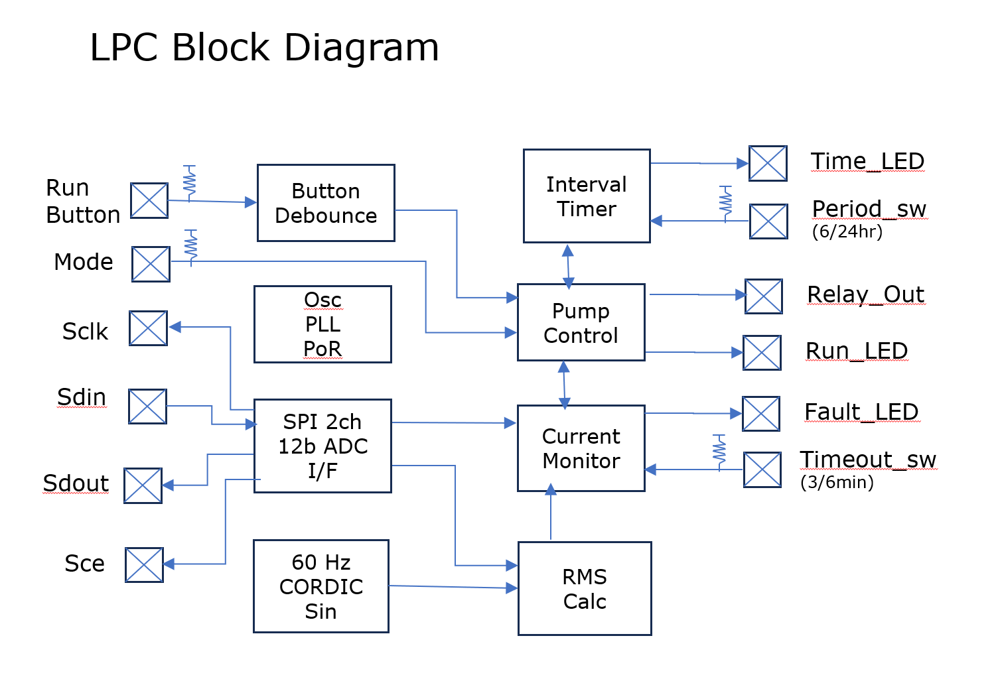
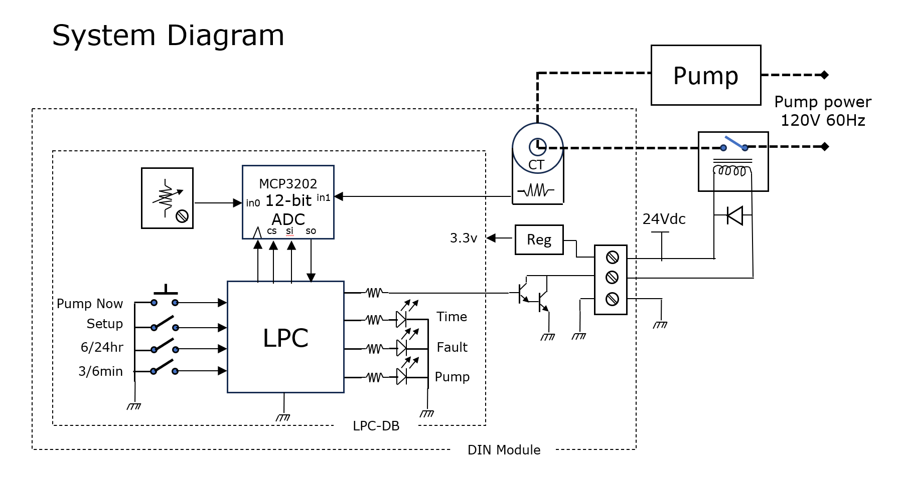
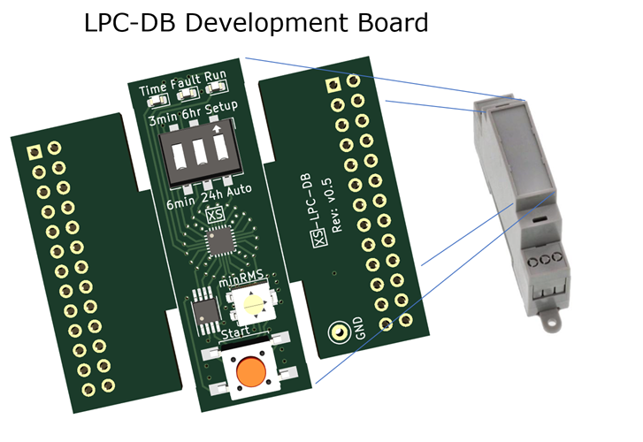
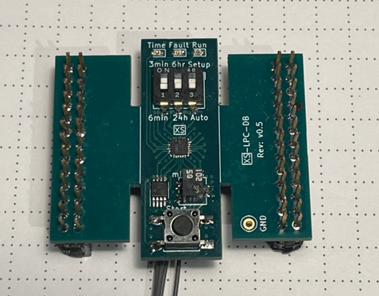

<!---

This file is used to generate your project datasheet. Please fill in the information below and delete any unused
sections.

You can also include images in this folder and reference them in the markdown. Each image must be less than
512 kb in size, and the combined size of all images must be less than 1 MB.
-->

## How it works

A pump-out chip runs a pump until the tank is empty. A liquid pump controller, or LPC. The chips function is upon power up, and every 24hrs, turn on the pump, and using a current transformer (CT) measures the 60 Hz RMS current and observe a current drop indicating the tank has been emptied, or until a timeout has occurred and then turn off the pump. Leds indicate status, and button allows starting a pump out operation at any time.

A chip starts with a [Datasheet](LPC_Datasheet.pdf) where features are fleshed out, and boiled down to a few key diagrams: the chip block diagram, the system diagram, and a development platform to be used to bring up the chip as part of a product development. These are all before doing any design.

The chip  block diagram showing the key modules and critically the I/O and how it relates to the functions. A crisp clear picture of the chip's architecture.

The system diagram provides the context of the chip. How do the I/O connect to the rest of the system, what part of the system function is inside the chip and what part is outside. Another crisp clear picture of the chip from the outside.

In order to bring up a new chip requires a way to bring it to life. A development board is one way. Such a board provides a means to connect the chip into the system, and enable bring up and validation of the device an enable rapid product development by enabling full observability and emulation. 

For the LPC chip development board heart a 24 pin 3mm forge fpga with cut-away emulator wings. From the top we have the time, fault, run leds, the control dip switch, the LPC chip, a 2ch adc, potentiometer, and button.

## How to test

How did I test the design, and how should the chip be tested when it returns.

Design testing:

RTL testing at 16x speedup (changed internal dividers), with the testbench including ADC model, and a plant model. Used verilator to greatly speed up itterations, but still ran the TT icarus precision flow.

GL testing is much shorter, but one thing it does validate is to make sure the 16x speedup is not included in the gates (always fear parameters).

FPGA Max10 testing. Even with verilator full system simulation was not possible given the 24hour duty cycle, 15x true real time was used with the ADC and plant models being synthesized into the fpga along with the LPC_core.sv

Chip Testing

A FPGA Max 10 chip tester was designed by putting the adc model and plant model into an fpga. To test this a 2nd Max 10 was setup as a chip emulator, and to observe the interaction between the 2 a 3rd Max 10 was setup as a monitor with 32MByte of storage PSRAM and HDMI vga, fully observed teh chips's I/O. All of these boards inteconnected via the LPC dev board emulation header. Teh TT chip will plug into this emulation header with the Tester and Monitor FPGAs.

A development board was fully designed and implemented with the chip I/O all wired to emulation headers. The TT develoement board pmods will be jump wired to the emulation header pins. The Max10 monitor fpga board will be able to observe the interaction between the TT chip and the LPC dev board. The LPC dev board connects to a power board contain the CT (current transformer) and pump relay. The bring up of the dev board used the chip Max 10 emulator and the Max 10 monitor.

Renesas forge 1k-lut OTP fpga emulation of the TT chip. I find these chips are about the equivalent of a 1x2 TT design with similar (less) I/O. They are self contained with build in Osc, PLL, and power on reset, and configure from OTP in 10ms. The LPC design was ported and implemented in a Forge fpga. The FPGA itself was tested against the Max10 tester, and then connected to the dev board by the emulation header, and penultimately soldered onto the dev board, and run in-system.

## External hardware

The LPC dev board with the 3mm x 3mm forge fpga mounted. This board has been tested in system. The TT dev baord can be jumpered to the header (and the forge held in reset) to allow full system testing.
